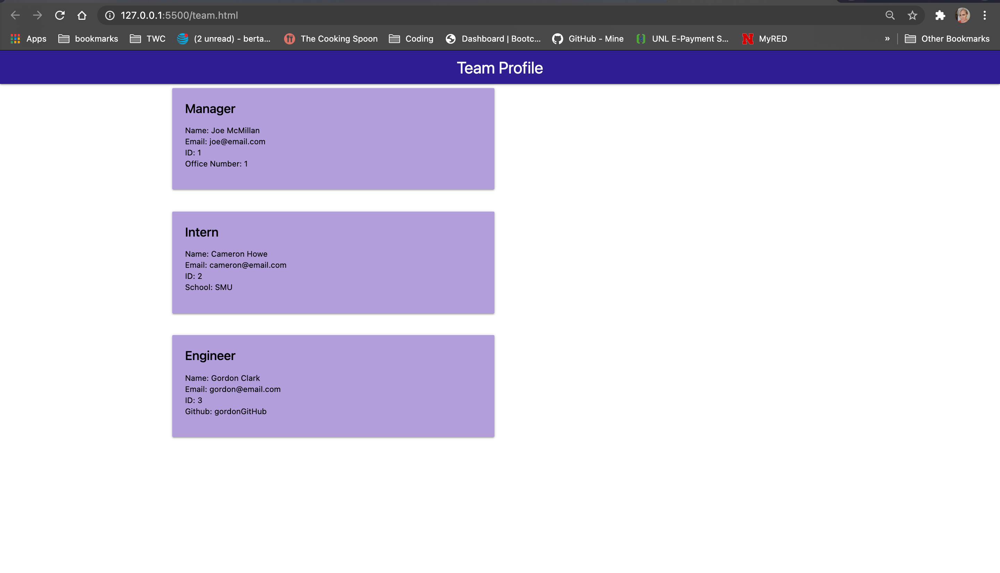

# team-profile-generator

This team profile generator is a Node.js command-line application that takes in information about employees on a software engineering team, then generates an HTML webpage that displays summaries for each person.

The user is asked to input the new employees' name, email, and id.  The user is then prompted to select the new employees' title...Engineer, Manager or Intern.  Once a title is selected the user is asked for additional information based on the title selected. The team.html page is automatically generated showing each employee's information based on their title.

